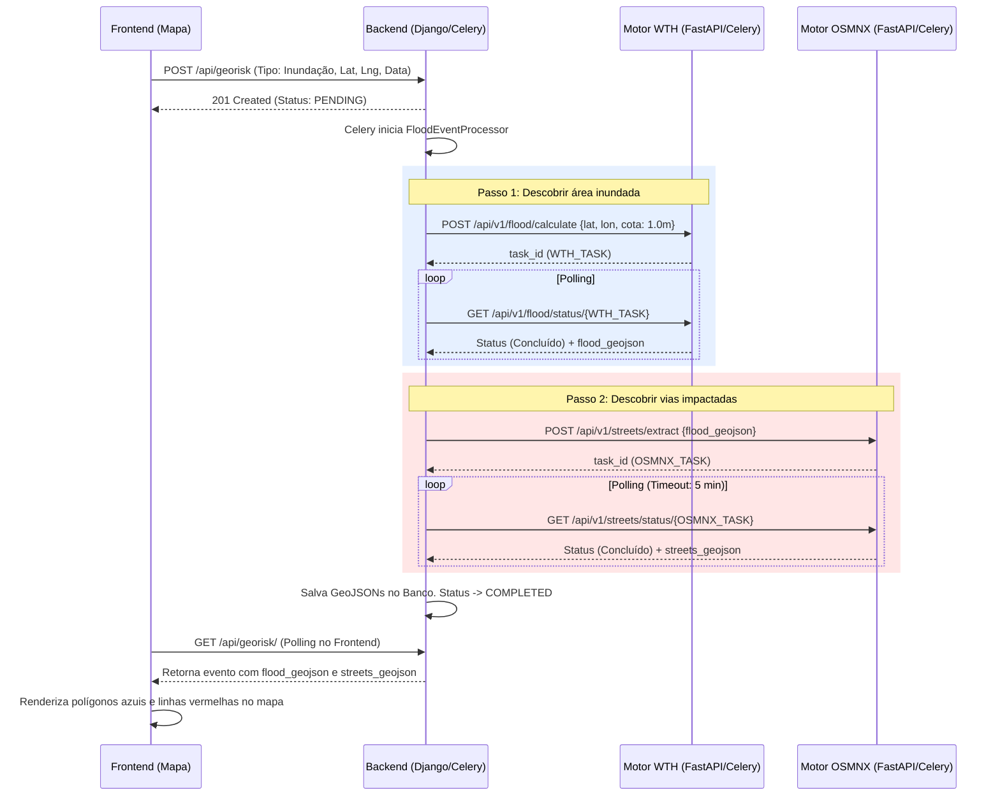

# Documentação Técnica: Fluxo de Inundação (Risk Network)

Este documento descreve detalhadamente o funcionamento da cadeia de IA responsável pelo processamento de eventos de "Inundação", envolvendo o Motor WTH e o Motor OSMNX.

---

## 1. Estrutura de Arquivos e Fluxograma

Para que o fluxo completo de Inundação funcione, a seguinte estrutura de pastas, arquivos e serviços é necessária no ambiente:

```text
Projeto_final_filter/
├── docker-compose.yml              # Configuração do Redis (Message Broker)
│
├── WTH_MOTOR_VALIDATE/             # Motor de Inteligência Artificial WTH (Água)
│   ├── main.py                     # FastAPI: Recebe requisições e gerencia status
│   ├── worker.py                   # Celery Task: Lê os raster (.tif) e calcula a mancha d'água
│   └── *.tif                       # Arquivos GeoTIFF (Modelos Digitais de Elevação)
│
├── osmnx_street/                   # Motor OSMNX (Vias Impactadas)
│   ├── main.py                     # FastAPI: Recebe requisições e gerencia status
│   └── worker.py                   # Celery Task: Consulta o OpenStreetMap e cruza com a mancha
│
├── risk_network_backend/           # Aplicação Principal (Django)
│   ├── core/celery.py              # Configuração do Celery da aplicação principal
│   └── georisk/
│       ├── processors.py           # Factory e Strategy (FloodEventProcessor gerencia o fluxo)
│       └── tasks.py                # Task Orquestradora que aciona a Factory
│
└── risk_network_frontend/          # Interface do Usuário (React/Vite)
    └── src/pages/GeoRisk.jsx       # Componente de Mapa que envia o evento e desenha o GeoJSON
```

### Fluxograma de Execução



---

## 2. Funcionamento Independente dos Motores

Os motores foram construídos em uma arquitetura de microserviços orientada a eventos. Cada um possui sua própria API REST (FastAPI) e seu próprio worker assíncrono (Celery), comunicando-se com a aplicação através do banco Redis.

### Motor WTH (Water Terrain Heuristics)
O Motor WTH é especializado em **Análise Topográfica e Modelagem de Elevação**.

*   **Objetivo Independente:** Dado um ponto geográfico e uma "cota" (ex: 1 metro), ele calcula até onde a água pode se espalhar ao redor daquele ponto sem ultrapassar a barreira de 1 metro de elevação em relação ao ponto inicial.
*   **Parâmetros de Entrada:** `latitude`, `longitude`, `cota` (nível da água em metros).
*   **Metodologia:**
    1.  O sistema carrega os arquivos locais do tipo **Raster/GeoTIFF** (`.tif`), que são matrizes contendo a elevação (altitude) de cada metro quadrado de terreno.
    2.  Descobre em qual pixel das matrizes a `latitude` e `longitude` passadas se encaixam e extrai a **altitude base** desse ponto.
    3.  Usando algoritmos de "Region Growing" (busca por vizinhança na matriz), ele navega a partir do ponto central para todos os pixels adjacentes. Se a altitude do vizinho for `menor ou igual` à `altitude base + cota`, ele é considerado submerso e o algoritmo avança.
    4.  Caso a mancha avance para a fronteira de um arquivo `.tif`, o motor identifica os arquivos vizinhos cruzando a fronteira e continua a expansão topográfica.
    5.  Ao final, os pixels agrupados são vetorizados e convertidos para um polígono no formato **GeoJSON**.

### Motor OSMNX (OpenStreetMap Network Extractor)
O Motor OSMNX é especializado em **Análise de Redes Viárias e Interseção Espacial**.

*   **Objetivo Independente:** Dado um polígono qualquer na Terra, descobrir e recortar exatamente quais ruas e avenidas estão dentro daquele polígono.
*   **Parâmetros de Entrada:** Um `GeoJSON` (FeatureCollection) do tipo `Polygon` ou `MultiPolygon`.
*   **Metodologia:**
    1.  A biblioteca `osmnx` converte o GeoJSON recebido para uma geometria (`shapely`).
    2.  É feito o cálculo da "Bounding Box" (o menor retângulo capaz de englobar o polígono inteiro) + um leve *buffer*.
    3.  A API realiza uma requisição oficial para a rede do **OpenStreetMap**, baixando o grafo viário de todas as ruas dentro da Bounding Box (tipos de via padrão: `drive`, ruas asfaltadas).
    4.  O grafo viário em formato de linhas (LineStrings) é convertido para um `GeoDataFrame`.
    5.  Ocorre a interseção espacial: todas as linhas de ruas são cruzadas espacialmente contra o polígono. Ruas fora da mancha são descartadas e ruas longas são "recortadas" nos limites da mancha.
    6.  O resultado retorna as vias (com nomes, tipo, limites de velocidade etc.) empacotadas no formato **GeoJSON**.

---

## 3. Conexão e Integração na Aplicação (Risk Network)

O coração da aplicação que coordena essa cadeia fica no `risk_network_backend`. 

A integração obedece à filosofia **SOLID** (através da `EventProcessorFactory`). Quando o backend (Django) percebe que um evento é do tipo **"Inundação"**:
1.  **Isolamento:** Ele instila o `FloodEventProcessor`, garantindo que toda lógica de IA não trave ou suje fluxos de eventos menores (como queimadas e geadas).
2.  **Orquestração em Cascata:**
    *   O Processor faz a requisição para a **WTH API** (`:8001`) passando as coordenadas onde o usuário clicou.
    *   A WTH API repassa para o WTH Celery, que lê os TIFs de mais de 2GB de terreno e desenha o GeoJSON de forma 100% autônoma. O Django fica em *polling* aguardando a finalização.
    *   Com a mancha d'água (`flood_geojson`) em mãos, o Processor inicia o Passo 2: faz uma requisição para a **OSMNX API** (`:8002`), repassando esse exato polígono.
    *   O OSMNX Celery extrai o mapa viário local, intercepta com a mancha recebida do WTH, e devolve as `streets_geojson`.
3.  **Persistência e Frontend:**
    *   As vias vermelhas e a mancha azul ficam armazenadas no banco de dados do Django acopladas ao ID do evento.
    *   O React consumirá esses dados e utilizará a biblioteca `react-leaflet` (`<GeoJSON />`) para plotar visualmente as informações sem nenhum esforço extra, pintando o impacto da catástrofe direto na tela.
